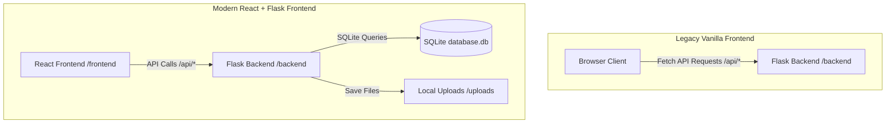

# ऋचाएं — Richa Sharma Stories & Blogs (Project Summary)

Welcome to the project summary for **ऋचाएं (Richa Sharma Stories & Blogs)**. This platform hosts English and Hindi stories, articles, series, comics, and dramas.

---

## 🏗️ Architecture Overview

The repository has been migrated to use a fully self-contained **SQLite Database** and **Local File Storage**, managed via a Python Flask backend.



### 1. Unified Backend (Flask + SQLite)
* **Backend (`/backend`)**: A Flask Python web server ([app.py](file:///G:/RIcha%20MAM/backend/app.py)) that:
  1. Manages database records locally using SQLite (`database.db`).
  2. Implements standard password hashing via `werkzeug.security` and secure signed user sessions via `itsdangerous` serialization.
  3. Handles media uploads, storing files in the local `/uploads` directory and serving them at `/uploads/<filename>`.
  4. Serves the built React application static assets (`/frontend/dist`) in production environments.
* **Deployment Script**: [render-build.sh](file:///G:/RIcha%20MAM/render-build.sh) installs frontend node modules, runs the production build, and installs python dependencies.

### 2. Frontend Variations
* **Modern React Version (`/frontend`)**: A React Single-Page Application (SPA) built using Vite. It utilizes `react-router-dom` for page routing and `axios` to query the backend server.
* **Legacy Monolithic Version (Root Folder)**: Pure HTML5, CSS3, and Vanilla JavaScript (`index.html`, `story.html`, `editor.html`, `login.html`). The scripts [db.js](file:///G:/RIcha%20MAM/db.js) and [auth.js](file:///G:/RIcha%20MAM/auth.js) have been rewritten to query the local Flask backend `/api` routes instead of direct external API calls.
* **Local Serving**: [docker-compose.yml](file:///G:/RIcha%20MAM/docker-compose.yml) serves the root folder using [nginx.conf](file:///G:/RIcha%20MAM/nginx.conf).

---

## 📁 Repository Directory Structure

Below is the layout of the project directories and all files:

* 📂 **Root Directory (Legacy / Root Project Configs)**
  * [index.html](file:///G:/RIcha%20MAM/index.html) — Main website homepage (Vanilla)
  * [story.html](file:///G:/RIcha%20MAM/story.html) — Story rendering and reading page (Vanilla)
  * [editor.html](file:///G:/RIcha%20MAM/editor.html) — Admin story editor and creator (Vanilla)
  * [login.html](file:///G:/RIcha%20MAM/login.html) — Admin & User login/signup panel (Vanilla)
  * [index.css](file:///G:/RIcha%20MAM/index.css) — Custom stylesheet containing variables, animations, and Category styles
  * [db.js](file:///G:/RIcha%20MAM/db.js) — SQLite database integration helpers (Vanilla)
  * [auth.js](file:///G:/RIcha%20MAM/auth.js) — Handles user registration and SQLite authentication sessions (Vanilla)
  * [app.js](file:///G:/RIcha%20MAM/app.js) — Custom UI scripting and smooth scroll helpers
  * [nginx.conf](file:///G:/RIcha%20MAM/nginx.conf) — Nginx server configuration for static asset caching and routing
  * [docker-compose.yml](file:///G:/RIcha%20MAM/docker-compose.yml) — Docker environment file for launching the Nginx-hosted vanilla site locally
  * [render-build.sh](file:///G:/RIcha%20MAM/render-build.sh) — Shell script for Render deployment builds
  * [.gitignore](file:///G:/RIcha%20MAM/.gitignore) — Root Git ignore definitions
  * [README.md](file:///G:/RIcha%20MAM/README.md) — Documentation and overview for project setup
  * [summary.md](file:///G:/RIcha%20MAM/summary.md) — The comprehensive project summary file (this file)
  * `Screenshot 2026-03-06 224638.png` — Screenshot of the application interface

* 📂 **`/backend` (Python Flask SQLite API)**
  * [app.py](file:///G:/RIcha%20MAM/backend/app.py) — The Flask web server serving SQLite APIs, local file uploads, and React static builds
  * `database.db` — SQLite database file containing all stories, comments, and registered users (auto-created on startup)
  * 📂 `uploads/` — Local directory storing all uploaded files & story images
  * [requirements.txt](file:///G:/RIcha%20MAM/backend/requirements.txt) — Python libraries list (`Flask`, `requests`, `Flask-CORS`)
  * [Procfile](file:///G:/RIcha%20MAM/backend/Procfile) — Instructions for launching the Flask app on web-servers (e.g., Render, Heroku)

* 📂 **`/frontend` (React SPA)**
  * [package.json](file:///G:/RIcha%20MAM/frontend/package.json) — Frontend package specifications & scripts (`dev`, `build`, `lint`)
  * [vite.config.js](file:///G:/RIcha%20MAM/frontend/vite.config.js) — Vite configuration for React build plugins
  * [eslint.config.js](file:///G:/RIcha%20MAM/frontend/eslint.config.js) — ESLint configuration details for syntax/style checking
  * [index.html](file:///G:/RIcha%20MAM/frontend/index.html) — Shell HTML document for Vite-based React rendering
  * [.gitignore](file:///G:/RIcha%20MAM/frontend/.gitignore) — Version control ignores specifically for the frontend directory
  * [README.md](file:///G:/RIcha%20MAM/frontend/README.md) — Frontend specific setup documentation
  * 📂 **`public/`**
    * `favicon.svg` — Website browser tab icon
    * `icons.svg` — Custom SVG sprite icons referenced throughout the application
  * 📂 **`src/`**
    * [main.jsx](file:///G:/RIcha%20MAM/frontend/src/main.jsx) — React application root entry point
    * [App.jsx](file:///G:/RIcha%20MAM/frontend/src/App.jsx) — Main app definition establishing routing pages
    * [App.css](file:///G:/RIcha%20MAM/frontend/src/App.css) — Stylesheet containing variables, transitions, and text editor styles
    * [index.css](file:///G:/RIcha%20MAM/frontend/src/index.css) — Custom styling tokens, categories-based fonts, layout structures
    * 📂 **`assets/`**
      * `hero.png` — Hero image background used on the home page
      * `react.svg` — React logo SVG asset
      * `vite.svg` — Vite logo SVG asset
    * 📂 **`pages/`**
      * [HomePage.jsx](file:///G:/RIcha%20MAM/frontend/src/pages/HomePage.jsx) — Home page displaying categories of stories
      * [StoryPage.jsx](file:///G:/RIcha%20MAM/frontend/src/pages/StoryPage.jsx) — Reader page for displaying stories and comment threads
      * [EditorPage.jsx](file:///G:/RIcha%20MAM/frontend/src/pages/EditorPage.jsx) — Authoring workspace to write, update, and publish stories
      * [LoginPage.jsx](file:///G:/RIcha%20MAM/frontend/src/pages/LoginPage.jsx) — Login & Signup forms page
    * 📂 **`components/`**
      * [Header.jsx](file:///G:/RIcha%20MAM/frontend/src/components/Header.jsx) — Navigation and header panel component
      * [Footer.jsx](file:///G:/RIcha%20MAM/frontend/src/components/Footer.jsx) — Page footer with social references
      * [StoryCard.jsx](file:///G:/RIcha%20MAM/frontend/src/components/StoryCard.jsx) — Post card component with styles specific to the post category
      * [AuthModal.jsx](file:///G:/RIcha%20MAM/frontend/src/components/AuthModal.jsx) — Overlay modal handling quick login/signup processes
    * 📂 **`services/`**
      * [api.js](file:///G:/RIcha%20MAM/frontend/src/services/api.js) — Requests handler to query Flask SQLite backend and perform file uploads
      * [auth.js](file:///G:/RIcha%20MAM/frontend/src/services/auth.js) — Client-side token storage and session managers

---

## 🎨 Theme, Styling, & Typography

The application sports a **Dark Neon Theme** with beautiful CSS glow animations and premium styling. A core design feature is **Category-Based Custom Typography**, which pairs specific Google Fonts to different genres:

| Category | Used For | Headings Font | Body/Paragraph Font | Style / Vibe |
| :--- | :--- | :--- | :--- | :--- |
| **All UI** | Buttons, Inputs, Menus | `Outfit` | `Outfit` | Clean, Modern |
| **Hindi** | Hindi scripts | `Baloo 2` / `Tiro Devanagari` | `Noto Sans Devanagari` / `Hind` | Classic Devanagari |
| **story** | Traditional stories | `Lora` (Serif) | `Lora` (Serif) | Literary, Bookish |
| **article** | Blog posts, articles | `Merriweather` | `Merriweather` | Editorial, Readable |
| **series** | Episodic chapters | `Rajdhani` (Glow style) | `Outfit` | Tech-savvy, Futuristic |
| **comics** | Graphic, illustration panels | `Bangers` | `Comic Neue` | Comic Book, Fun |
| **drama** | Play scripts, theater blogs | `Lora` (Italicized) | `Lora` | Expressive, Artistic |
| **wgws** | WGWS specific works | `Merriweather` (Accent color) | `Merriweather` | Editorial, Sleek |

---

## 💾 Database Schema (SQLite)

The local SQLite database file `database.db` contains the following schema:

1. **`users`**
   * Stores credentials of registered readers and admins.
   * *Columns*: `id` (INTEGER PRIMARY KEY AUTOINCREMENT), `email` (TEXT UNIQUE), `password_hash` (TEXT), `name` (TEXT), `role` (TEXT DEFAULT 'user'), `created_at` (TIMESTAMP).
   * *Seeded Admin*: `admin@richasharma.com` (Password: `admin123`).

2. **`stories`**
   * Stores all stories, blogs, and series written by the authors.
   * *Columns*: `id` (INTEGER PRIMARY KEY AUTOINCREMENT), `title` (TEXT), `content` (TEXT), `excerpt` (TEXT), `category` (TEXT), `cover_image_url` (TEXT), `cover_image_key` (TEXT), `author_id` (INTEGER), `created_at` (TIMESTAMP), `FOREIGN KEY(author_id) REFERENCES users(id)`.

3. **`comments`**
   * Stores comments linked to stories.
   * *Columns*: `id` (INTEGER PRIMARY KEY AUTOINCREMENT), `story_id` (INTEGER), `user_id` (INTEGER), `content` (TEXT), `created_at` (TIMESTAMP), `FOREIGN KEY(story_id) REFERENCES stories(id) ON DELETE CASCADE, FOREIGN KEY(user_id) REFERENCES users(id)`.

4. **Storage (`/backend/uploads` folder)**
   * Images uploaded via the editor are stored locally on the server.
   * On successful upload, a unique file is saved and accessed via `/uploads/<filename>`.

---

## 🛠️ Recent Fixes & Updates (June 15, 2026)

* **Photo Upload Resolution**:
  * Found that the Flask server was serving a cached/old compiled React bundle from `/frontend/dist` which attempted direct uploads to InsForge.
  * Rebuilt the React frontend bundle (`npm run build`) to use the new local SQLite endpoint `/api/upload`.
  * Verified that image files upload successfully to `/backend/uploads` and render correctly using `/uploads/<filename>` routes.

* **Rich Text Editor Enhancements**:
  * Added bullet lists, numbered lists, blockquotes, horizontal dividers, text color palette selection, headings (Heading 1 to 4), font size adjustment (Small to Extra Large), and Undo/Redo commands to both the React ([EditorPage.jsx](file:///g:/RIcha%20MAM/frontend/src/pages/EditorPage.jsx)) and Vanilla HTML ([editor.html](file:///g:/RIcha%20MAM/editor.html)) editors.
  * Designed premium dark-neon theme styling for these newly supported elements (headings, lists, blockquotes, and dividers) in [index.css](file:///g:/RIcha%20MAM/index.css) and [App.css](file:///g:/RIcha%20MAM/frontend/src/App.css) for consistent layout rendering on story viewing pages.
  * Rebuilt the React frontend bundle (`npm run build`) to update compiled static assets served by the Flask backend.

---

## 🚀 How to Run the Project

### 1. Modern React + Flask Backend (Recommended)
#### Backend Setup:
1. Open a terminal and navigate to `/backend`.
2. Install dependencies:
   ```bash
   pip install -r requirements.txt
   ```
3. Run the development server:
   ```bash
   python app.py
   ```
   *Runs by default on `http://127.0.0.1:5000` (which auto-creates the `database.db` file and seeds the default admin user).*

#### Frontend Setup:
1. Open a terminal and navigate to `/frontend`.
2. Install dependencies:
   ```bash
   npm install
   ```
3. Run the React development server:
   ```bash
   npm run dev
   ```
   *Usually runs on `http://localhost:5173`.*

### 2. Legacy Static Version (Docker Compose)
If you wish to view the legacy vanilla HTML/JS version of the site running against the local backend:
1. Make sure Docker is installed.
2. Launch the Flask backend server on port 5000 (so that `/api` calls can be processed).
3. Run the following command in the root folder to start Nginx:
   ```bash
   docker-compose up
   ```
4. Access the web interface at `http://localhost:80`.
